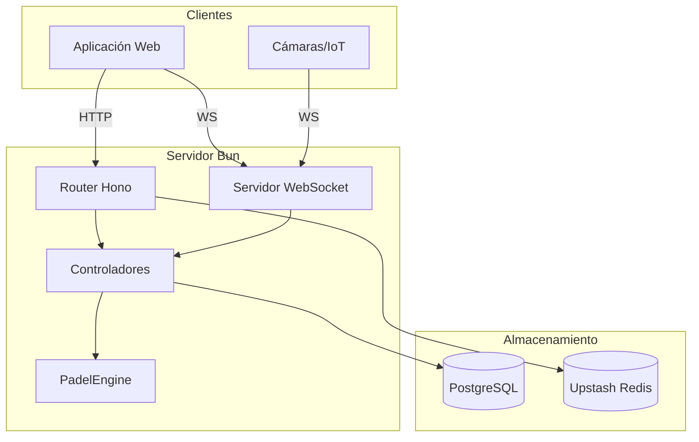
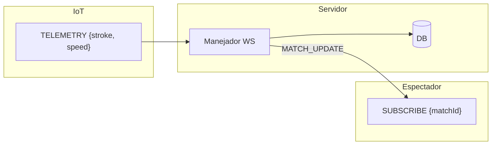

   
   

  # <code>BACKEND_SPECS</code>

  **DOCUMENTACIÓN_DE_LA_API_Y_ARQUITECTURA_DEL_SISTEMA**
   

  
  
  

   
   

---

### 00 __ ARQUITECTURA

| COMPONENTE | TECNOLOGÍA | NOTA |
| :--- | :--- | :--- |
| **Entorno (Runtime)** | `Bun 1.x` | [Native ServerWebSocket] |
| **Router** | `Hono` | [API REST Estándar] |
| **ORM** | `Drizzle` | [Interfaz PostgreSQL] |
| **Caché** | `Redis` | [Upstash / Limitación de tasa (Rate Limiting)] |

 

### 01 __ API HTTP

**URL BASE:** `/api`

| MÉTODO | ENDPOINT | DESCRIPCIÓN | TABLA |
| :--- | :--- | :--- | :--- |
| `GET` | `/matches` | Listar partidos | `matches` |
| `POST` | `/matches` | Crear partido | `matches` |
| `POST` | `/matches/:id/point` | Registrar punto | `point_history` |
| `GET` | `/courts` | Estado de las pistas | `courts` |

> **NOTA:** `POST /matches` crea el estado inicial 0-0. `POST /point` gestiona la lógica del juego a través de `PadelEngine`.

 

### 02 __ API WEBSOCKET

**URL:** `ws://localhost:8000/ws`
**RATE LIMIT:** 5 sol / 10s por IP.

#### A. TIPOS DE CLIENTE

| TIPO | AUTH | CAPACIDADES |
| :--- | :--- | :--- |
| **Espectador** | `Ninguna` | `SUBSCRIBE`, `REQUEST_STATS` |
| **Dispositivo IoT** | `Token` | `TELEMETRY_EVENT` |

#### B. FLUJO DE MENSAJES (PUBSUB)

 

### 03 __ FLUJOS DE DATOS

#### 1. PUNTUACIÓN (RUTA CRÍTICA)
1.  **ENTRADA:** `POST /point` O `TELEMETRY_EVENT`
2.  **MOTOR (ENGINE):** `PadelEngine.processPoint(snapshot, side)`
3.  **DB:** Transacción (`INSERT point`, `UPDATE stats`, `UPDATE match`)
4.  **DIFUSIÓN (BROADCAST):** `server.publish(matchId, MATCH_UPDATE)`

#### 2. AUTENTICACIÓN IOT
1.  **ENTRADA:** `AUTH_DEVICE { token }`
2.  **VERIFICACIÓN:** `SELECT * FROM courts WHERE auth_token = ?`
3.  **RESULTADO:** Asociar Socket ID con Court ID.
4.  **ACTIVACIÓN:** Permitir mensajes `TELEMETRY_EVENT`.

 

### 04 __ ESQUEMA DE BASE DE DATOS

| TABLA | PK | DESCRIPCIÓN |
| :--- | :--- | :--- |
| `players` | `id` | Nombre, país, ranking |
| `matches` | `id` | Puntuación actual, servidor, estado |
| `courts` | `id` | Token de auth, ref al partido activo |
| `point_history` | `id` | Registro de cada punto (replay) |
| `match_stats` | `id` | Estadísticas granulares por jugador |

 

 
<code>DOCUMENTACIÓN MANTENIDA POR <a href='https://github.com/samuhlo'>samuhlo</a></code>

