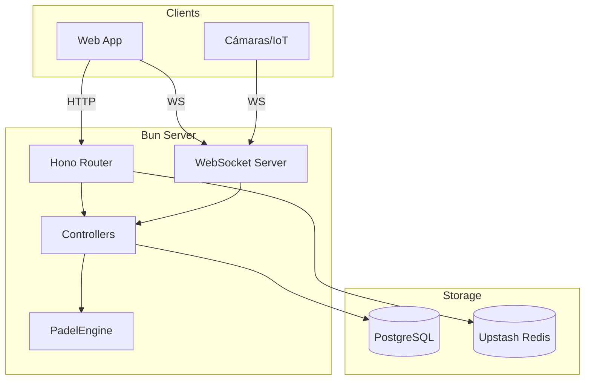
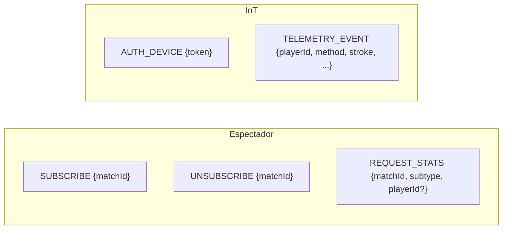
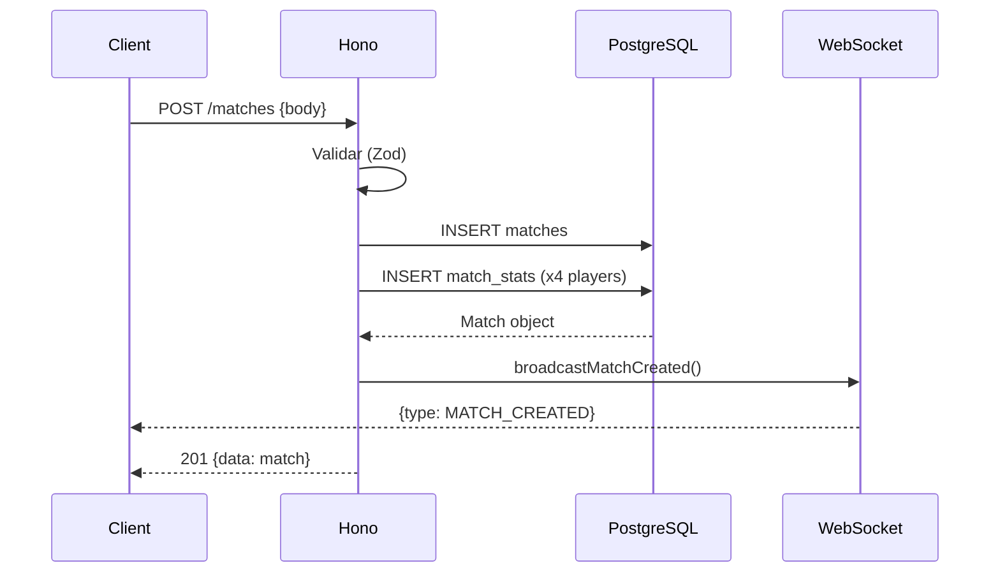
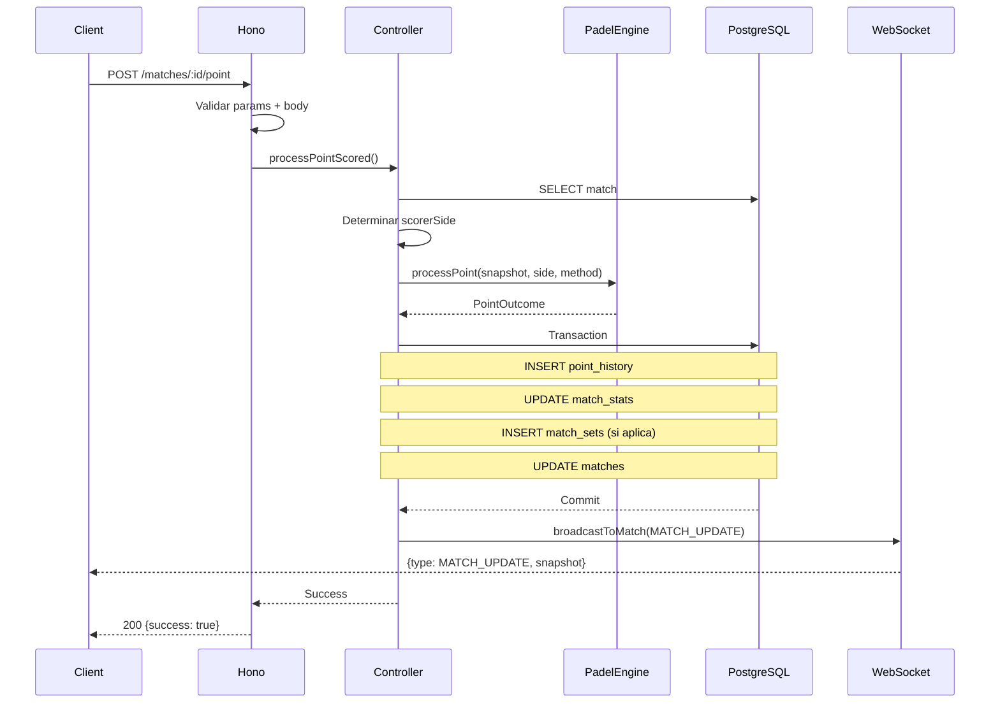
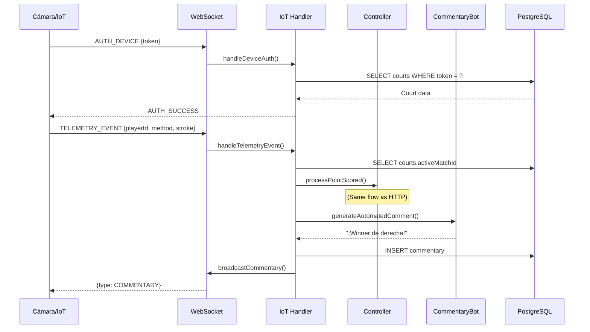
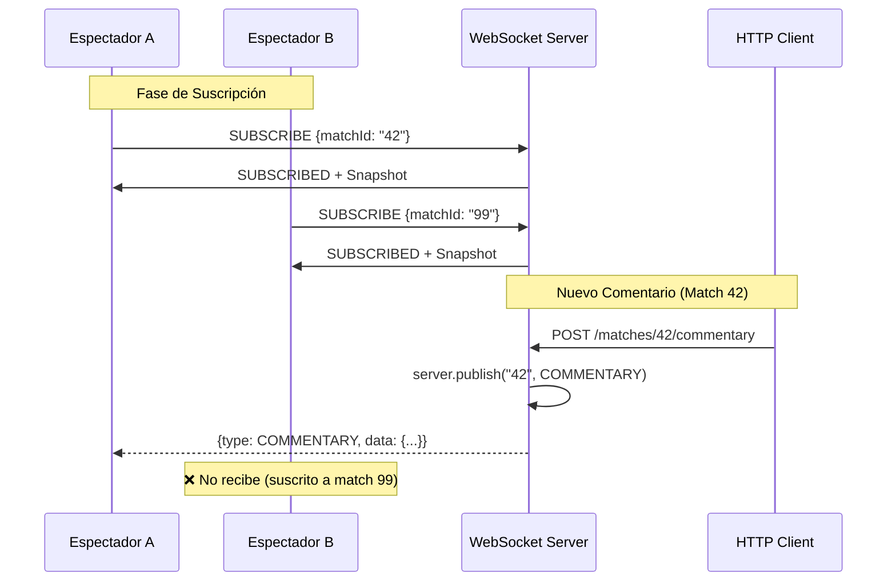
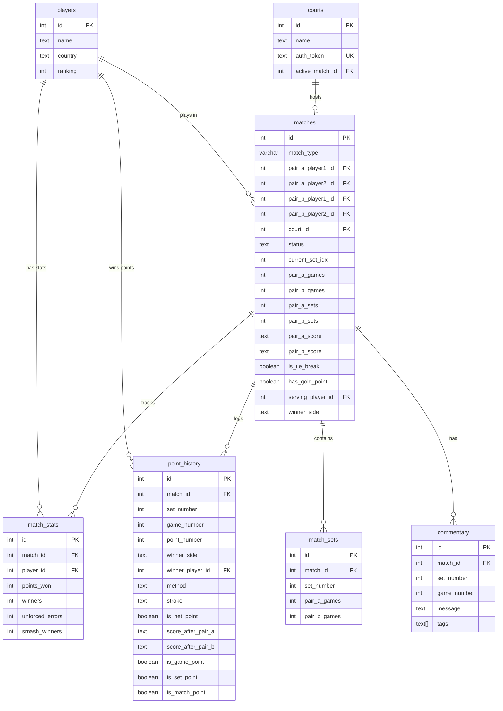

# 📖 Documentación Completa: Padel Counters Backend

> Última actualización: 2026-02-08

---

## 🏗️ Arquitectura General



| Componente | Tecnología |
|:--|:--|
| Runtime | Bun 1.x |
| HTTP Router | Hono |
| WebSocket | Bun nativo (ServerWebSocket) |
| Base de Datos | PostgreSQL + Drizzle ORM |
| Rate Limiting | Upstash Redis (Sliding Window) |
| Validación | Zod |

---

## 🌐 HTTP API (REST)

### Rutas Montadas

| Prefijo | Archivo | Descripción |
|:--|:--|:--|
| `/matches` | [matches.ts](../src/routes/matches.ts) | CRUD de partidos |
| `/matches/:id/commentary` | [commentary.ts](../src/routes/commentary.ts) | Feed minuto a minuto |
| `/courts` | [courts.ts](../src/routes/courts.ts) | Estado de pistas |

### Endpoints

| Método | Endpoint | Descripción | Tablas Afectadas |
|:--|:--|:--|:--|
| `GET` | `/` | Health check | - |
| `GET` | `/matches` | Lista partidos | `matches` |
| `POST` | `/matches` | Crea partido + stats iniciales | `matches`, `match_stats` |
| `POST` | `/matches/:id/point` | Registra punto | `matches`, `point_history`, `match_stats`, `match_sets` |
| `GET` | `/matches/:id/commentary` | Lista comentarios | `commentary` |
| `POST` | `/matches/:id/commentary` | Crea comentario + broadcast | `commentary` |
| `GET` | `/courts` | Lista pistas y estado | `courts` |

---

## ⚡ WebSocket API

### Conexión

```
ws://localhost:8000/ws
```

Rate limiting: **5 conexiones / 10s** por IP (bypass en test environment).

---

### Tipos de Cliente

| Tipo | Autenticación | Mensajes Permitidos |
|:--|:--|:--|
| **Espectador** | Ninguna | `SUBSCRIBE`, `UNSUBSCRIBE`, `REQUEST_STATS` |
| **Dispositivo IoT** | Token (`AUTH_DEVICE`) | `TELEMETRY_EVENT` (post-auth) |

---

### Mensajes Client → Server



| Tipo | Payload | Handler | Acción |
|:--|:--|:--|:--|
| `SUBSCRIBE` | `{matchId: string}` | [subscription.ts](../src/ws/handlers/subscription.ts) | Suscribe al topic + envía snapshot inicial |
| `UNSUBSCRIBE` | `{matchId: string}` | subscription.ts | Desuscribe del topic |
| `REQUEST_STATS` | `{matchId, subtype: "PLAYER" | "MATCH_SUMMARY", playerId?}` | [stats.ts](../src/ws/handlers/stats.ts) | Query a DB y respuesta directa |
| `AUTH_DEVICE` | `{token: string}` | [iot.ts](../src/ws/handlers/iot.ts) | Valida token vs `courts.authToken`, marca socket como dispositivo |
| `TELEMETRY_EVENT` | `{playerId, stroke, speed, method, isNetPoint}` | iot.ts | Procesa punto + genera comentario automático |

---

### Mensajes Server → Client

| Tipo | Payload | Cuándo se emite |
|:--|:--|:--|
| `WELCOME` | `string` | Al conectar |
| `SUBSCRIBED` / `UNSUBSCRIBED` | `string` | Confirmación de suscripción |
| `AUTH_SUCCESS` | `{courtName}` | Autenticación IoT exitosa |
| `MATCH_UPDATE` | `{matchId, timestamp, snapshot, lastPoint}` | Cada punto o al suscribirse |
| `COMMENTARY` | `{data: Commentary}` | Nuevo comentario |
| `MATCH_CREATED` | `{data: Match}` | Nuevo partido (global broadcast) |
| `STATS_RESPONSE` | `{subtype, matchId, data}` | Respuesta a `REQUEST_STATS` |
| `ERROR` | `string` | Cualquier error |

---

## 🔄 Flujo de Datos

### 1. Creación de Partido (HTTP)



**Tablas:**
- `matches` → Nueva fila con marcador inicial (0-0)
- `match_stats` → 4 filas (una por jugador) con estadísticas en 0

---

### 2. Registro de Punto (HTTP)



**Tablas:**
- `point_history` → Log del punto con contexto (set, game, method, flags)
- `match_stats` → +1 winner/error según acción
- `match_sets` → Nueva fila si el set terminó
- `matches` → Actualización del marcador actual

---

### 3. Telemetría IoT (WebSocket)



**Tablas:**
- `courts` → Lookup por `authToken`, read `activeMatchId`
- `players` → Lookup nombre para comentario
- `commentary` → Nueva fila con texto generado
- + Todas las tablas del flujo de punto

---

### 4. Comentarios en Tiempo Real (Pub/Sub)

> [!IMPORTANT]
> Los comentarios se entregan **únicamente** a los clientes suscritos al partido específico mediante el sistema **Pub/Sub nativo de Bun**.



| Paso | Código | Archivo |
|:--|:--|:--|
| 1. Cliente envía `SUBSCRIBE` | `socket.subscribe(matchId)` | [subscription.ts](../src/ws/handlers/subscription.ts#L45) |
| 2. Comentario se guarda en DB | `INSERT INTO commentary` | [matchService.ts](../src/services/matchService.ts#L329-338) |
| 3. Broadcast al topic | `server.publish(matchId, ...)` | [utils.ts](../src/ws/utils.ts#L71) |
| 4. Solo suscritos reciben | Filtrado automático por Bun | Runtime nativo |

**Orígenes del broadcast:**

| Trigger | Descripción |
|:--|:--|
| `POST /matches/:id/commentary` | Comentario manual desde HTTP API |
| `TELEMETRY_EVENT` (IoT) | Comentario automático generado por `CommentaryBot` |

> [!TIP]
> El topic de pub/sub coincide con el `matchId` como string. Un cliente puede suscribirse a múltiples partidos simultáneamente.

---

## 🗄️ Modelo de Base de Datos



---

## 🔐 Seguridad

| Capa | Mecanismo |
|:--|:--|
| Rate Limiting | Upstash Redis (5 req/10s por IP en `/ws`) |
| IoT Auth | Token único por pista (`courts.authToken`) |
| Validación | Zod schemas estrictos en cada entrada |
| IP Detection | `CF-Connecting-IP` → `X-Forwarded-For` → Socket IP |

---

## 📁 Estructura de Archivos

```
src/
├── index.ts              # Entry point (Hono + Bun.serve)
├── routes/
│   ├── matches.ts        # CRUD partidos + POST point
│   └── commentary.ts     # GET/POST commentary
├── ws/
│   ├── server.ts         # Router WS (open/message/close)
│   ├── utils.ts          # sendJson, broadcast functions
│   └── handlers/
│       ├── subscription.ts  # SUBSCRIBE/UNSUBSCRIBE
│       ├── stats.ts         # REQUEST_STATS
│       └── iot.ts           # AUTH_DEVICE, TELEMETRY_EVENT
├── controllers/
│   └── match.ts          # processPointScored, getMatchSnapshot
├── utils/
│   ├── padelScoring.ts   # PadelEngine (lógica pura)
│   ├── match-status.ts   # Cálculo de estado
│   └── commentaryBot.ts  # Generador de comentarios
├── db/
│   ├── db.ts             # Cliente Drizzle
│   └── schema.ts         # Tablas + Relaciones + Enums
├── types/
│   ├── index.ts             # Barrel export centralizado
│   ├── db.types.ts          # Tipos inferidos de Drizzle (Match, Player, enums)
│   ├── padel.types.ts       # MatchSnapshot, PointOutcome, TelemetryData
│   └── websocket.types.ts   # ClientMessage, ServerMessage, WebSocketData
└── validation/
    ├── matches.ts        # createMatchSchema
    ├── commentary.ts     # createCommentarySchema
    └── point_action.ts   # pointActionSchema
```

---

> [!TIP]
> **Extensibilidad IoT:** Para añadir una nueva pista, insertar fila en `courts` con un `authToken` único. La cámara usa ese token para autenticarse y enviar telemetría.

> [!IMPORTANT]
> **Stateless Engine:** `PadelEngine` es puro y no accede a la DB. El Controller es responsable de la persistencia y el broadcast.
