```mermaid
graph TB
    subgraph Clients
        WEB[Web App]
        IOT[Cámaras/IoT]
    end

    subgraph Server["Bun Server"]
        HONO[Hono Router]
        WS[WebSocket Server]
        CTRL[Controllers]
        ENGINE[PadelEngine]
    end

    subgraph Storage
        PG[(PostgreSQL)]
        REDIS[(Upstash Redis)]
    end

    WEB --HTTP--> HONO
    WEB --WS--> WS
    IOT --WS--> WS
    HONO --> CTRL
    WS --> CTRL
    CTRL --> ENGINE
    CTRL --> PG
    HONO --> REDIS
```
   
   

  # <code>BACKEND_SPECS</code>

  **SYSTEM_ARCHITECTURE_AND_API_DOCUMENTATION**
   

  
  
  

   
   

---

### 00 __ ARCHITECTURE

| COMPONENT | TECH | NOTE |
| :--- | :--- | :--- |
| **Runtime** | `Bun 1.x` | [Native ServerWebSocket] |
| **Router** | `Hono` | [Standard REST API] |
| **ORM** | `Drizzle` | [PostgreSQL Interface] |
| **Cache** | `Redis` | [Upstash / Rate Limiting] |

 

### 01 __ HTTP API

**BASE URL:** `/api`

| METHOD | ENDPOINT | DESCRIPTION | TABLE |
| :--- | :--- | :--- | :--- |
| `GET` | `/matches` | List matches | `matches` |
| `POST` | `/matches` | Create match | `matches` |
| `POST` | `/matches/:id/point` | Register point | `point_history` |
| `GET` | `/courts` | Court status | `courts` |

> **NOTE:** `POST /matches` creates initial 0-0 state. `POST /point` handles game logic via `PadelEngine`.

 

### 02 __ WEBSOCKET API

**URL:** `ws://localhost:8000/ws`
**RATE LIMIT:** 5 req / 10s per IP.

#### A. CLIENT TYPES

| TYPE | AUTH | CAPABILITIES |
| :--- | :--- | :--- |
| **Spectator** | `None` | `SUBSCRIBE`, `REQUEST_STATS` |
| **IoT Device** | `Token` | `TELEMETRY_EVENT` |

#### B. MESSAGE FLOW (PUBSUB)

 

### 03 __ DATA FLOWS

#### 1. POINT SCORING (CRITICAL PATH)
1.  **INPUT:** `POST /point` OR `TELEMETRY_EVENT`
2.  **ENGINE:** `PadelEngine.processPoint(snapshot, side)`
3.  **DB:** Transaction (`INSERT point`, `UPDATE stats`, `UPDATE match`)
4.  **BROADCAST:** `server.publish(matchId, MATCH_UPDATE)`

#### 2. IOT AUTHENTICATION
1.  **INPUT:** `AUTH_DEVICE { token }`
2.  **CHECK:** `SELECT * FROM courts WHERE auth_token = ?`
3.  **RESULT:** Associate Socket ID with Court ID.
4.  **ENABLE:** Allow `TELEMETRY_EVENT` messages.

 

### 04 __ DATABASE SCHEMA

| TABLE | PK | DESCRIPTION |
| :--- | :--- | :--- |
| `players` | `id` | Name, country, ranking |
| `matches` | `id` | Current score, server, status |
| `courts` | `id` | Auth token, active match ref |
| `point_history` | `id` | Log of every point (replay) |
| `match_stats` | `id` | Granular stats per player |

 

 
<code>DOCUMENTATION MAINTAINED BY <a href='https://github.com/samuhlo'>samuhlo</a></code>

